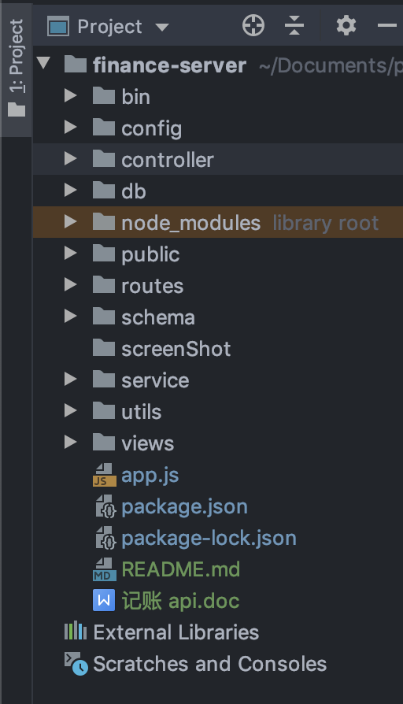
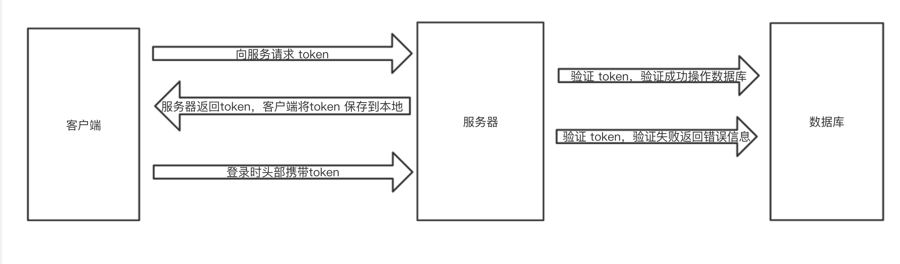

# 基于 Express 的后端服务器

### 1.简述
这个项目是微信小程序记账 app 的后端代码，这个项目的目录是这样的


* config: 配置文件
* routes: 路由配置
* utils: 工具类
* db: 操作数据库的代码
* controller: 控制是当前地址否要 token 验证
* service: 如何调用操作数据库函数（我也不知道为什么要写controller，service，感觉这两个写一个就可以了）

### 2.遇到的问题
   (1). token 验证问题？
   
   关于 token 验证问题我使用了 jsonwebtoken 插件，故先用 npm 安装这个插件。
        token 验证流程大概如下图：
        
   使用这个插件: 定义两个方法，一个用来生成 token，另一个用来验证 token。
   ```javascript
    /**
     * 生成token
     * @param {object} content  对某个内容生成 token
     */
    const access_token=function (content) {
        let secret = 'jizhangxitongfinancegeorgeleeo';  // 秘钥
        let expiresIn = Math.round((new Date().getTime()/1000)) + 3600; // 过期时间
        let token = jwt.sign(content, secret, { expiresIn });
        return {
            token,
            expiresIn
        };
    }
    /**
     * 验证token
     * @param {string} token token值
     */
    const check_token= function (token) {
        let secret = 'jizhangxitongfinancegeorgeleeo';  // 秘钥，根生成的 token 要一致
        return new Promise((resolve, reject) => {
            jwt.verify(token, secret, (err, decode) => {
                if (err) {
                    //时间失效或伪造 token 或 token 不存在
                    reject({
                        status: 10010,
                        error: 'invalid_token'
                    });
                } else {
                    resolve();
                }
            });
        })
    }
```

在controller.js 中，去判断 token 验证成功与否
```javascript
function billController(method, options, req, res) {
    // 验证 token
    utils.check_token(req.headers.authorization, res).then(() => {
        // token验证成功，调用操作数据库的方法
        billService[method](options).then((data) => {
            res.json(data);
        }).catch((err) => {
            res.json(err)
        });
    }).catch((err) => {
        // token 验证失败
        res.json(err)
    })
}
```
   (2). 文件上传问题？
   
   在这个项目中，有使用文件上传的功能，express 默认是带这个功能的，所以就必须使用 npm 
    安装 express-fileupload 这个插件，然后再 app.js 中引入并注册这个插件
```javascript
var fileUpload = require('express-fileupload');
app.use(fileUpload());
```
当前端发送文件时，后端从 `req.files['name']`获取 file 对象，然后通过 file.mv()方法进行文件存储
```javascript
    file.mv(fileSavePath, function (e) {
        if (e) {
            // 失败时
        } else {
            // 成功时
        }
    });
```
比如我的项目中，上传图片代码抽取出来就是
```javascript
    // 小程序代码
        wx.uploadFile({
            url: 'http://localhost:3000/users/avatar',
            filePath: 'XXXXXXX',
            name: 'avatar',
            header: {
                Authorization: headers.token,
                expiresIn: headers.expiresIn
            },
            formData: data,
            success: (res) => {},
            fail: (err) => {}
        });

    // 服务器代码
        let file = req.files.avatar
        file.mv('upload/a.png', function (e) {
            if (e) {
                // 失败时
            } else {
                // 成功时
            }
        });
```
   (3). 关于前端读取upload中图片的问题
   
   本来想用服务器的 ip 来读取项目中 upload 中的图片，但是发现并不能读取，或显示404，故最后将 upload 文件放在了项目的外边，
   然后对这个 upload 文件单独开了一个服务，把他当做图片服务器来使用。
### 3. 总结
当初选用 Express + MongoDB 的唯一原因就是开发快，因为基本上每天都满课，所以快速开发是我的需要。在这个项目中其实还有很多可以优化的地方，
还有一定的冗余，比如在操作数据的时候，所有的查询成功或失败的函数都可以存放到一个公共类里面，
而不是每一对应的文件里都有一个这个方法。